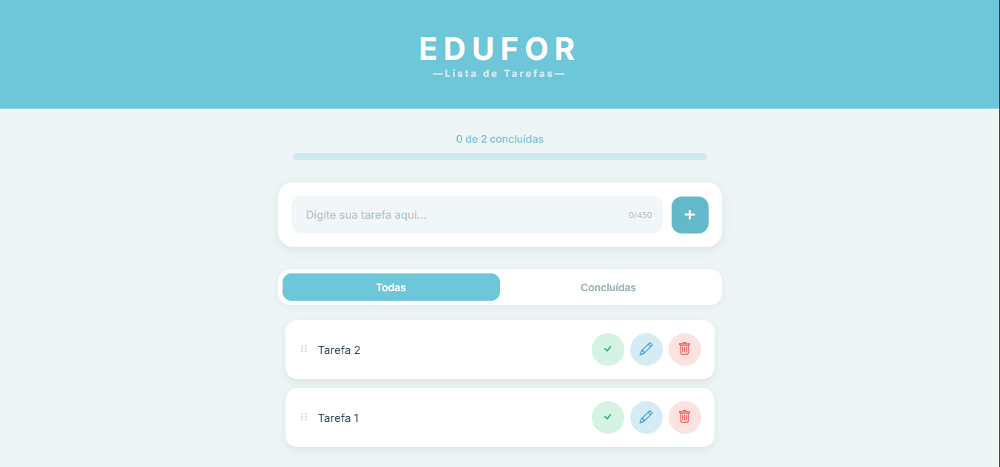

# ToDoList-Edufor

ToDoList desenvolvido para a disciplina de requisitos e modelagem de sistemas da Universidade de Fortaleza.

## Sobre o Projeto

Este projeto é uma atividade proposta pela faculdade, visando uma simulação de atividade real do mercado de trabalho. O objetivo é criar uma aplicação funcional e atrativa, focando em design, funcionalidade e responsividade.

## Tecnologias Utilizadas

- **HTML**: Estrutura da aplicação
- **CSS**: Estilização e design responsivo
- **JavaScript**: Lógica e interatividade
- **Bootstrap Icons**: Ícones utilizados na interface

## Funcionalidades

- Adicionar tarefas com limite de caracteres
- Marcar tarefas como concluídas
- Editar tarefas existentes
- Excluir tarefas individuais
- Limpar todas as tarefas concluídas (com confirmação)
- Filtrar tarefas (todas ou concluídas)
- Arrastar e soltar para reordenar tarefas
- Persistência de dados no localStorage
- Design responsivo para dispositivos móveis e desktop
- Barra de progresso das tarefas concluídas

## Como Executar

1. Clone ou baixe o repositório.
2. Abra o arquivo `EduFor/index.html` em um navegador web.
3. Comece a adicionar suas tarefas!

## Desenvolvedores

- João Victor Maciel
- Maria Eduarda Coutinho
- Bruno Facó
- Gabriel Campbel
- Igor Cavalcante
- João Gabriel Rinaldi
- Paulo Levi Pontes

## Licença

Este projeto é para fins educacionais e não possui licença específica.
